# IBM Applied Data Science Capstone

## Introduction
In the current real estate market, it’s estimated that almost half of the current housing market are millennials with 90% of those being renters. ([1](https://www.appfolio.com/blog/2014/08/10-things-you-need-to-know-about-the-millennial-renter-infographic)) When it comes to renting or buying a house, there are many factors that need to be considered before a decision can be taken. These issues are compounded when one has only online data and reviews from other people - reviews which might not reflect an entirely unbiased and objective evaluation and further complicated if the move is from a different city, state or even country.

Two factors that have a significant influence are the location of essential services and businesses in the vicinity of the property and the general safety of the neighborhood. Typically, websites listing properties for rent only display features confined to the property itself - rental price, carpet area, number of bedrooms, bathrooms, unit ameneties, etc. While these are primary motivators for renters, any additional information about the neighborhood and its offerings can only be learned by searching mutiple websites. Again, this information would likely still be missing safety information, and is typically restricted to intuition-based summaries and anecdotes. 

This project attempts to unify the two major secondary motivators - neighborhood amenities and safety information to provide a potential renter with all the pertinent tools to make an informed decision. The focuss of this project is on the city of Los Angeles, California. The Foursquare API will be our primary source for the former, to obtain a list of popular venues in every neighborhood in a city including restaurants, bars, and entertainment venues. The safety information will be obtained through crime records from open sourced data provided by the city. 

The neighborhood information will be displayed on an interactive map overlayed with recorded criminal activity around the venues. The integration of rental property listings as well as public transit information will be pursued as future avenues of work.

## Data
There are two separate datasets that we need to separately acquire and process before we can merge them to achieve our goal. The first will be the crime records from the Los Angeles Police Department (LAPD) for all the areas under its jurisdiction. The second will be the venue information for each neighborhood which can will be obtained via the Foursquare API.

### Crime Data
The LAPD administers 21 Geographic Areas within the department. The location of each precinct, the division or area name and the location of each Community Police Station was obtained from the [Los Angeles Open Data catalog](http://data-lahub.opendata.arcgis.com/datasets/031d488e158144d0b3aecaa9c888b7b3_0). The JSON object was parsed to extract the relevant information. 

The crime data for the areas administered by the Los Angeles Police Department was obtained from the [Los Angeles Open Data catalog](https://data.lacity.org/A-Safe-City/Crime-Data-from-2010-to-Present/y8tr-7khq). The dataset contains crime data dating back from 2010 to January 2019. This data is transcribed from original crime reports.

The format of the dataset is shown below. The full dataset contained approximately 1.9 million rows. To keep computing costs relatively low, only the crimes from 2018 were chosen. This reduced the working dataset to approximtely 225000 rows.

| Column Name | Description | Type |
|-------------------------|-------------------------------------------------------------------------------------------------------------------------------------------------------------------------------------------------------------------------------------------------------------------------------------------------------------|-------------|
| DR Number | Division of Records Number: Official file number made up of a 2 digit year, area ID, and 5 digits | Plain Text |
| Date Reported | MM/DD/YYYY | Date & Time |
| Date Occurred | MM/DD/YYYY | Date & Time |
| Time Occurred | In 24 hour military time | Plain Text |
| Area ID | The LAPD has 21 Community Police Stations referred to as Geographic Areas within the department. These Geographic Areas are sequentially numbered from 1-21 | Plain Text |
| Area Name | The 21 Geographic Areas or Patrol Divisions are also given a name designation that references a landmark or the surrounding community that it is responsible for | Plain Text |
| Reporting District | A four-digit code that represents a sub-area within a Geographic Area. All crime records reference the "RD" that it occurred in for statistical comparisons | Plain Text |
| Crime Code | Indicates the crime committed (Same as Crime Code 1) | Plain Text |
| Crime Code Description | Defines the Crime Code provided | Plain Text |
| MO Codes | Modus Operandi: Activities associated with the suspect in commission of the crime | Plain Text |
| Victim Age | Two character numeric | Plain Text |
| Victim Sex | F - Female M - Male X - Unknown | Plain Text |
| Victim Descent | Descent Code: A - Other Asian B - Black C - Chinese D - Cambodian F - Filipino G - Guamanian H - Hispanic/Latin/Mexican I - American Indian/Alaskan Native J - Japanese K - Korean L - Laotian O - Other P - Pacific Islander S - Samoan U - Hawaiian V - Vietnamese W - White X - Unknown Z - Asian Indian | Plain Text |
| Premise Code | The type of structure, vehicle, or location where the crime took place | Plain Text |
| Premise Description | Defines the Premise Code provided | Plain Text |
| Weapon Used Code | The type of weapon used in the crime | Plain Text |
| Weapon Used Description | Defines the Weapon Used Code provided | Plain Text |
| Status Code | Status of the case (IC is the default) | Plain Text |
| Status Description | Defines the Status Code provided | Plain Text |
| Crime Code 1 | Indicates the crime committed. Crime Code 1 is the primary and most serious one. Crime Code 2, 3, and 4 are respectively less serious offenses. Lower crime class numbers are more serious | Plain Text |
| Crime Code 2 | May contain a code for an additional crime, less serious than Crime Code 1 | Plain Text |
| Crime Code 3 | May contain a code for an additional crime, less serious than Crime Code 1 | Plain Text |
| Crime Code 4 | May contain a code for an additional crime, less serious than Crime Code 1 | Plain Text |
| Address | Street address of crime incident rounded to the nearest hundred block to maintain anonymity | Plain Text |
| Cross Street | Cross Street of rounded Address | Plain Text |
| Location | The location where the crime incident occurred. Actual address is omitted for confidentiality. XY coordinates reflect the nearest 100 block | Location |

### Cleaning the LAPD Crime Dataset

First, only the pertinent columns from the dataset were read into a dataframe. These columns were:
- DR Number
- Date Occurred
- Time Occurred
- Area ID
- Area Name
- Crime Code Description
- Location

The next step was to clean the data. This involved:
- Removing whitespace from column names
- Converting column names into lower case
- Splitting location data into latitude and longitude
- Dropping rows that contained NaN
- Typecasting columns
- Extracting additional information from Time and Date Occurred such as hour, minute, day of the week, date, month
- Finally, extracting only the crime records corresponding to the year 2018

### Visualization

We can now visualize the crimes that were committed in 2018 based on various parameters such as number of crimes per:

- Type of crime
The top 25 crimes from 2018 were plotted on a bar chart. It was not very surprising to see there were a lot of theft and assault related crimes. The large number of Identity Theft cases was a surprise - perhaps we can thank Equifax for that?

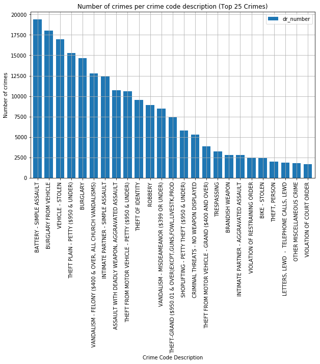

- Per month
The crimes from 2018 were plotted on a bar chart as number of crimes per month. The number of crimes stayed consistent with a dip in February and an increase in the summer months. This can be attributed to a lower number of days in that month.

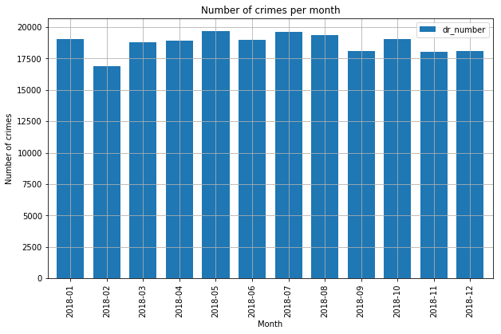

- Per day of the week
The crimes from 2018 were plotted on a bar chart as number of crimes per day of the week. The number of crimes stayed consistent with a slight increase on Fridays (day 5).

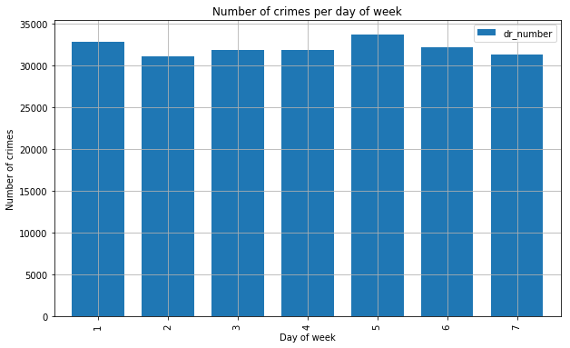

- Per day of the month
The crimes from 2018 were plotted on a bar chart as number of crimes per day of the month. The number of crimes stayed consistent throughout the month typically. The drop in number of crimes on the 31st is because not every month has 31 days. Similarly with reduced contributions from February (29th and 30th). It could potentially be an issue and the data would likely need a weighted average of some kind to scale it uniformly. 

The spike in crimes on the 1st day of the month is surprising. It could perhaps be attributed to pay days and the need for money to cover bills. Also, a careful look at the data revealed a significant percentage of the crimes on the 1st was on 1/1. NYE sees a lot of revellers out late and it could be a big driver in crimes on that date.

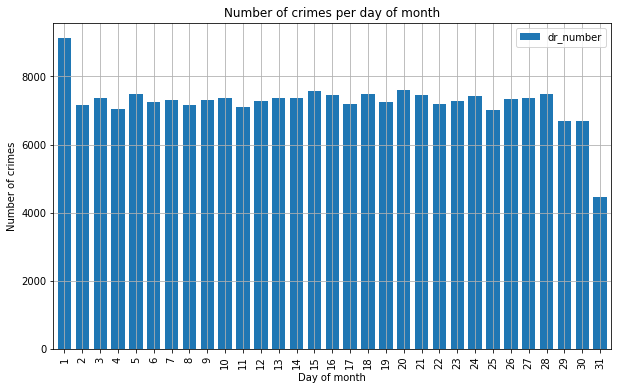

- Per time of day
The crimes from 2018 were plotted on a bar chart as number of crimes per time of day. The drop after midnight is not surprising. The spike at noon is though while the spikes later in the evening are as expected.

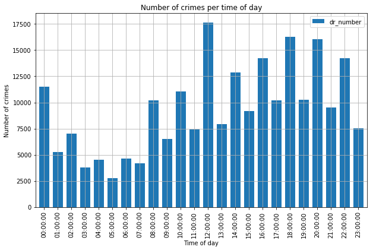

- Per area (name)
The crimes from 2018 were plotted on a bar chart as number of crimes per area of occurrence. It is clear which areas are the most dangerous - 77th Street, Central and Southwest are not the best neighborhoods in the city either. 

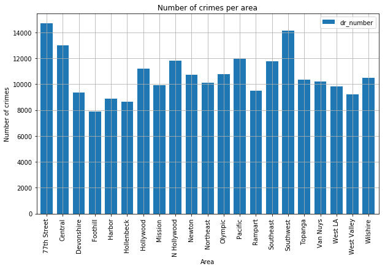

### More Cool Visualizations
The next section has some cool visualiztions that show the crime distributions in the city using choropleths, heat maps and cluster maps.

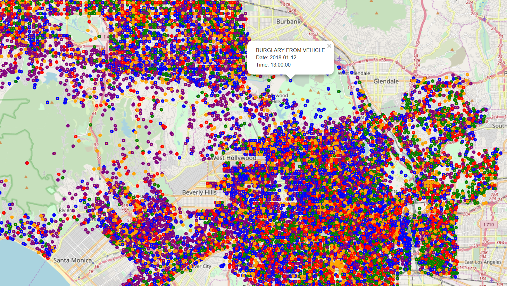
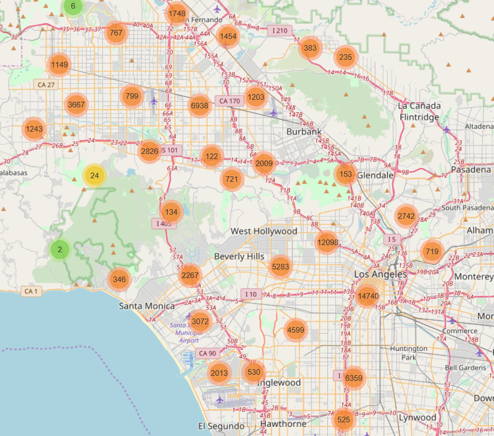
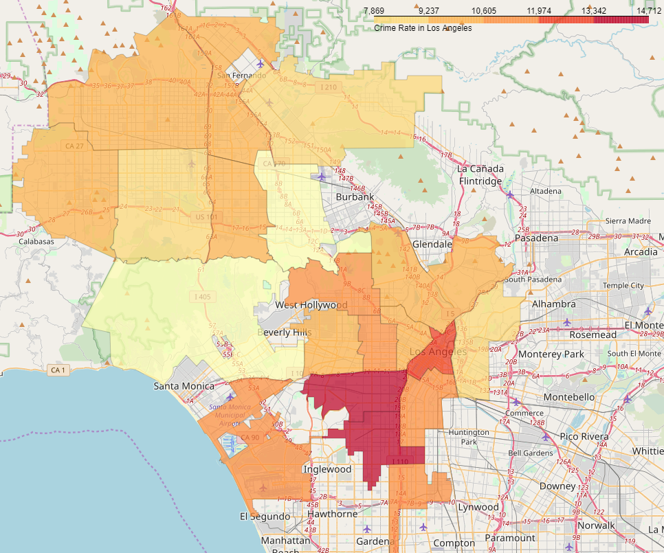

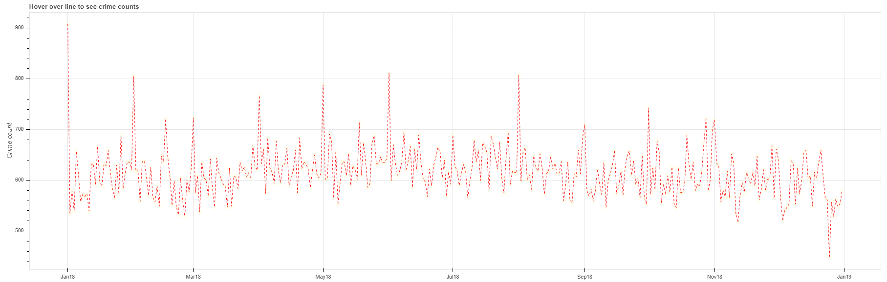

### Crime Data Modeling
The 2018 crime data frame was modeled using a Random Forest algorithm. The classification of crimes was based on location, time and date.
- The first step was to classify dangerous crimes such as assault and theft related crimes and assign them a value 1. All other crimes were classified with a 0.
- The next step was applying One-Hot Encoding on the hour of day, day of month, month, latitude and longitude where the crime occurred.

The RF algorithm was chosen to model and classify the dataset. This algorithm searches for the best feature among a random subset of features while splitting a node. Another important advantage of this algorithm is the ability to visualize the relative importance of different features. The dataset was split into train and test datasets. The hyperparameter *n_estimators* was tuned over a range of values from 5 to 500. The accuracy looked to be topping out at *n = 100*. The other hyperparameters were left to be at their default values.

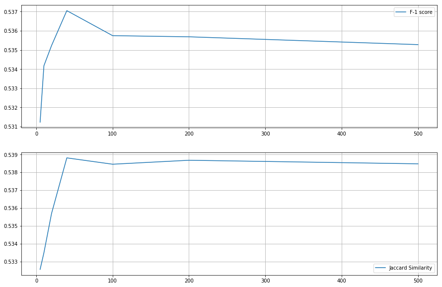

The important features were visualized and as expected, it is the location (latitude & longitude) feature which dominates over any other feature. 

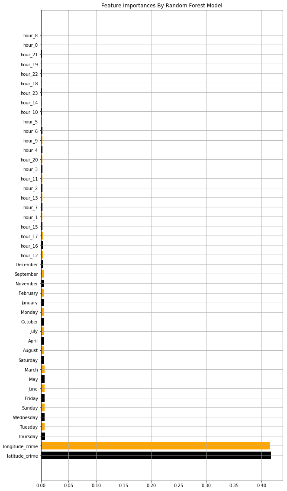

# Neighborhood and Venue Data

Having obtained, processed, modeled and studied the crime dataset, we focused on the second part of the project, which was to determine the desirability of a neighborhood from the perspective of its businesses and services. 

## Neighborhoods administered by the LAPD

The data for venues and businesses around a geographic location was obtained through the Foursquare API. The first step was to identify the neighborhoods for which crime data was available. This was necessary because the LAPD does not ohave jurisdiction over several areas in LA County and these are administered through their own police departments for which crime data was not available. 

The data for the neighborhoods served by the LAPD was scraped from the [LA Times website](http://maps.latimes.com/lapd/). The JSON object for each divison was inspected and the neighborhood information was extracted. Additionally, the latitude and longitude for each neighborhood was retrieved using the geocoder class. This dataframe was stored locally on the machine.

We also found there were some instances where parts of a neighborhood were administered by different divisions of the LAPD. In these instances, a simple assumption was made to assign the neighborhood to the first division it appeared under in the dataset. This can be handled more cleverly by partitioning the neighborhood but was deemed unnecessary for this analysis.

## Foursquare Venue Data

The next step was to use the Foursquare API to retrieve data for businesses and services around a particular neighborhood. We searched for the following categories of businesses and services in a 1 mile radius, limiting our results to 50 venues under each category:
* Arts & Entertainment - Music venues, Theatres, Concert Halls, Bowling Alleys
* Fitness Center - Gyms, Yoga Studios, Pilates
* Food - Restaurants, Fast-Food Joints, Cafes
* Medical Center - Hospitals, Urgent Care Clinics, Pharmacies
* Nightlife Spot - Bars, Lounges, Nightclubs
* Shop & Service - Grocery Stores, Utilities Providers, Services

Additionally, in order to beautify our map, we assigned a representative icon and color for each business belonging to one of the above categories.

The JSON object was inspected and the following details were extracted:
* Venue Name
* Venue ID
* Venue Category
* Venue Address
* Venue Latitude & Longitude

Using the Venue ID, a subsequent call was designed to extract the venue rating. However, this is a Premium endpoint and was limited to only 500 requests per day which was not sufficient to handle our dataset of approximately 24000 venues. While the code can be seen in the notebook, we subsequently discard the *venue_rating* column from our dataset as it does not contain any useful information. The dataframe was stored locally on the machine for faster retrieval.

## More Visualiztions!

Finally, we can superimpose our neighborhood data with the heat maps from our crime data to get an informative understanding of the safety of a neighborhood as well as its offerings. The maps were generated for 156 (yeah, LA is huge!) neighborhoods in LA. A few of them are shown here.

Please note the folium maps rendered by Jupyter do not show up on Github. This is a known issue, therefore, screenshots of the maps themselves have been included in the entire notebook.

### Downtown LA Venue + Crime Heat Map

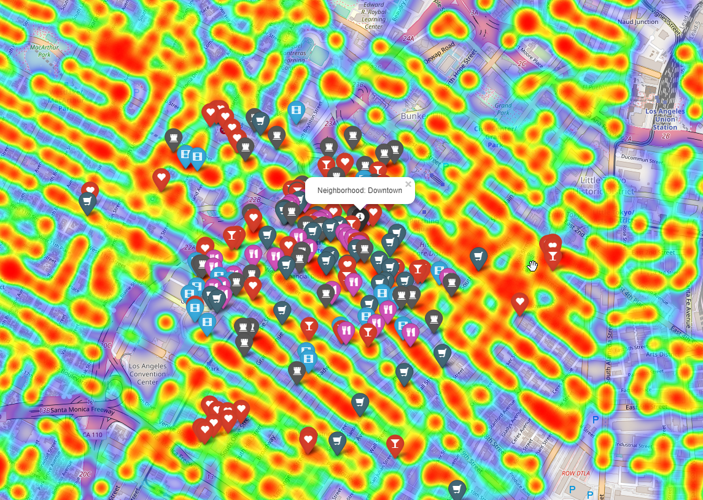

### Elysian Park Venue + Crime Heat Map

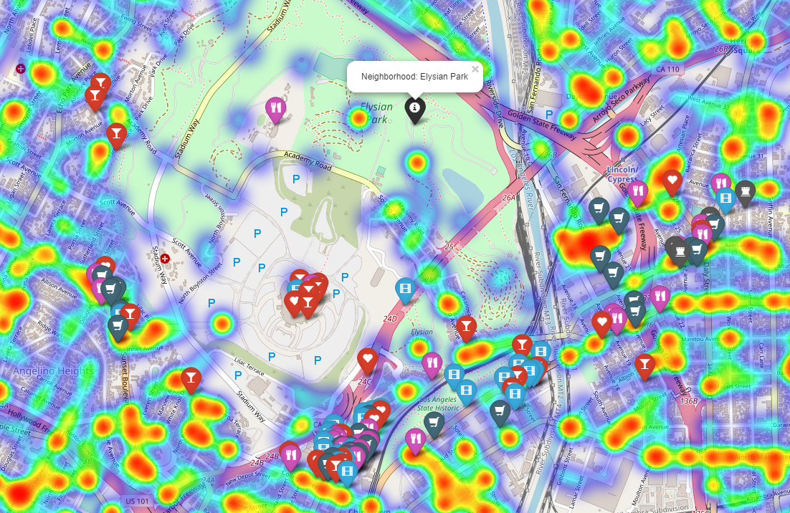

### Hollywood Venue + Crime Heat Map

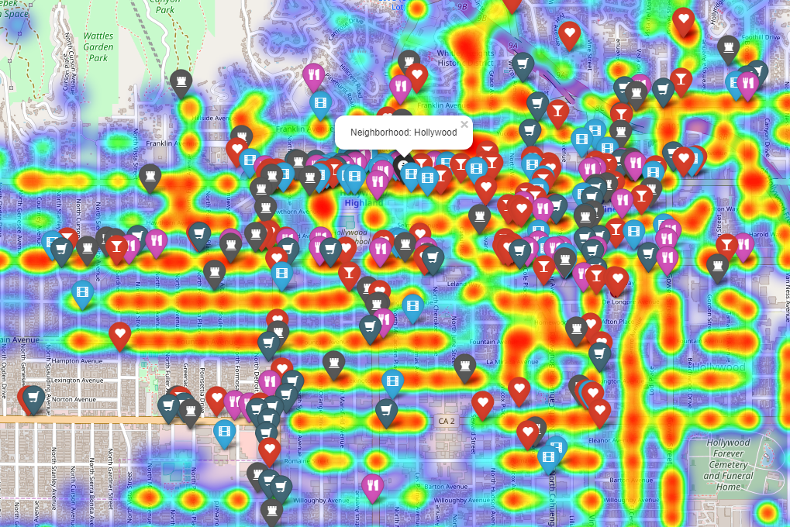

### Koreatown Venue + Crime Heat Map

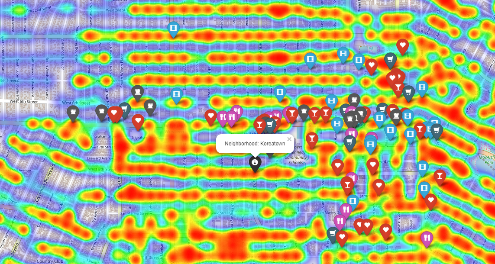

### Van Nuys Venue + Crime Heat Map

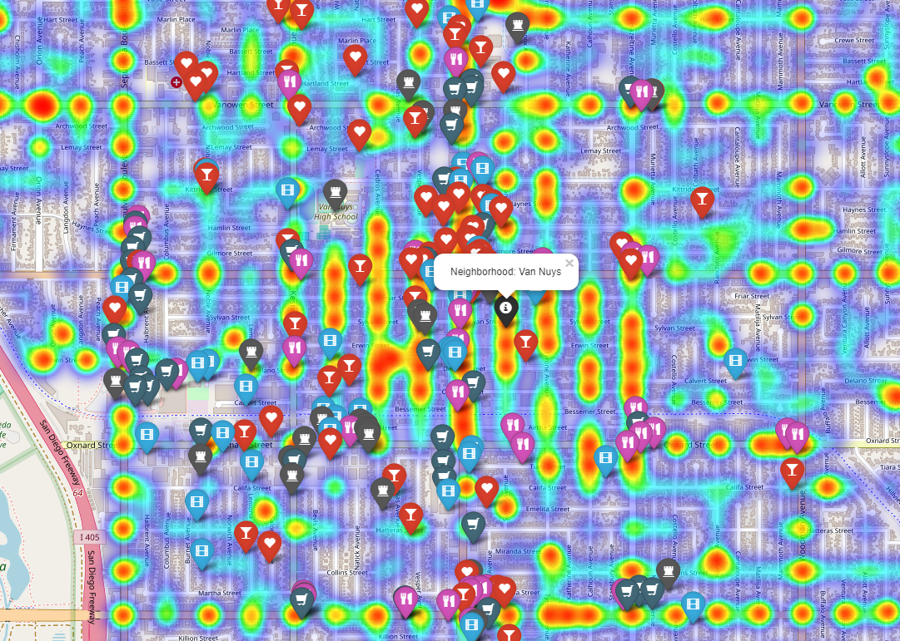

# Results and Discussion

From our analysis, we can evaluate a neighborhood based on its most recent crime history as well as its proximity to businesses such as restaurants and bars and other essential services such as grocery stores and utility providers. The goal of this project was to provide the user this information to aid them in the process of moving to a new neighborhood. 

While we believe this analysis was sufficient to meet the goals outlined for the project, it is not the most comprehensive collection of information. There are additional metrics such as rent pricing, commuting distance, public school ratings, walkscore ratings, etc. that must be taken into account when making an optimal choice. 

Future work, outside of the scope of this project, will be pursued. This includes some of the ideas discussed above:
- Rental Property data - Show rental pricing information for a neighborhood. Similar neighborhoods in terms of price, ameneties and proximity to businesses can be discovered using Unsupervised Learning methods, affording the user multiple choices, if possible.
- Public Transit data - Properties and businesses with a close proximity to public transit facilities often rank higher on various metrics, such as Walkscore. Using the LA Metro API, we can integrate this information to show a time-stamped availability of public transit services in the proximity of a property or business.
- Improved Recommendations - With more time to fetch individual venue ratings from the Foursquare API, it would be possible to show the user the top rated venues in each neighborhood as well as learn the user's preferences and suggest more relevant venues.
